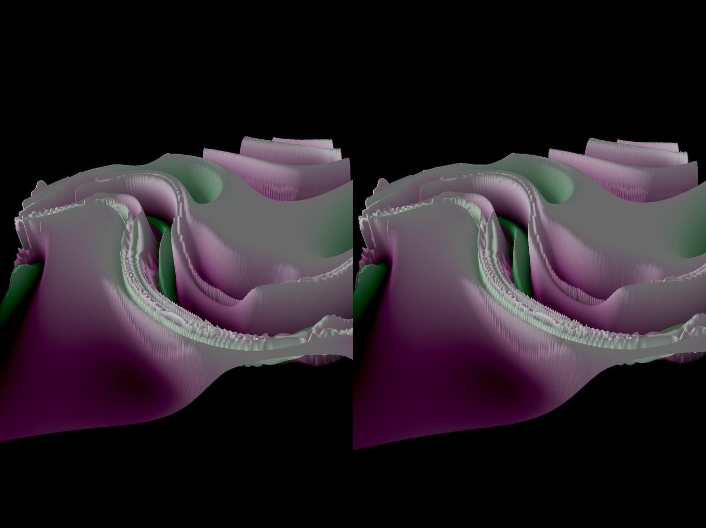

# MishMash
Collection of fractal algorithms in one app
Fractal for iPad uses Swift 4 and Metal

Help:
ViewController holds the email send/receive code.
Have a problem I hope someone can resolve for me:
If the program is in the 'recently used list' (use 4 fingers to sweep up from bottom of iPad), then remote loading doesn't always work.
Why? how to fix? 
otherwise, loading from email works okay..
Help:

Visit: https://fractalforums.org/fractal-mathematics-and-new-theories/28/triangle-inequality-average-algorithm/1368
User 3DickUlus posted a beautiful image with the fragment shader attached.
I copied the algorithm onto this app to do some experimentation.

Visit: http://flam3.com/ \
https://github.com/tariqksoliman/Fractal-Inferno

Flam3 is an IFS (Iterated Function System), where randommly chosen functions bounce a point \
around the screen to slowly build the final drawing.

This app uses the same functions, but the way a Mandelbrot renderer does, \
where each pixel of the final image is mapped to a starting seed point. \
That seed point is fed through the functions dictated by the grammar, and the cycles \
are counted until the point flys outside the escape radius (or a max count is reached). \
That cycle count is used to determine the color for that single pixel.

Collection of algorithms and UX from several other fractal apps,\
hoping to come with a new and interesting display.\
Jury is still out:  work in progress.\
Not really a fractal either. 

